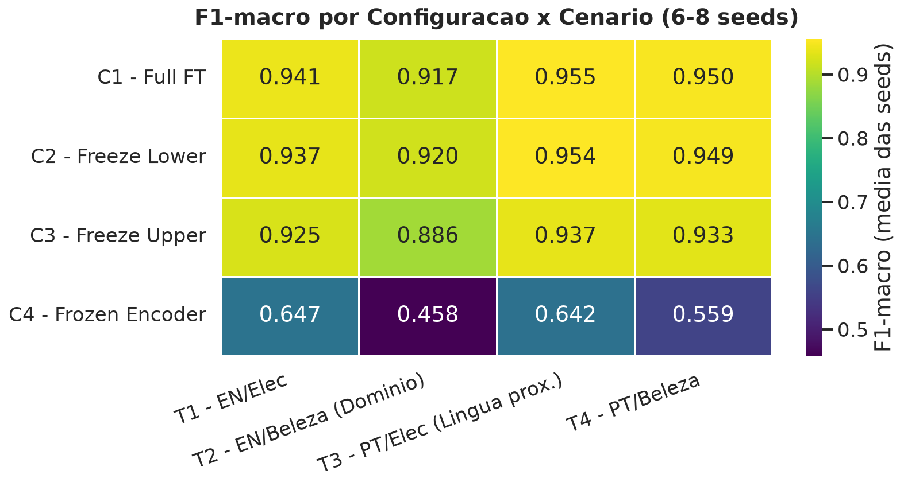
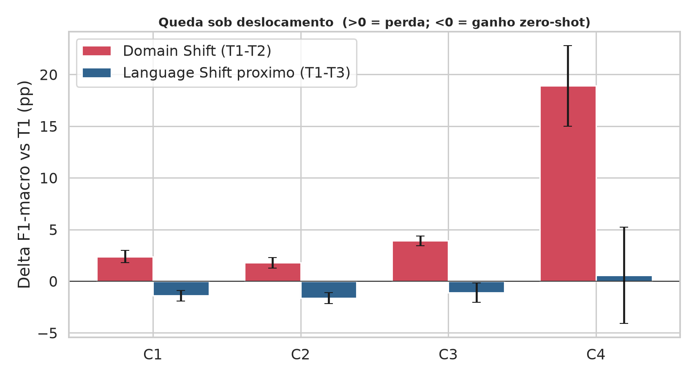

# Congelamento de Camadas em Transformers Multilingues

### Robustez do XLM-RoBERTa sob mudanca de dominio e de idioma

Analise Arquitetural do Congelamento de Camadas na Mitigacao de *Domain Shift* e *Language Shift*

UFG / INF - Redes Neurais Profundas

> Conteudo pronto para gerar os slides no Gamma. Cada bloco separado por `---` e um slide. Figuras em `resultados/`. Sem emojis.

---

## A pergunta central

Treinamos um classificador de sentimento em **Ingles / Eletronicos** e perguntamos:

**congelar seletivamente camadas do XLM-RoBERTa durante o *fine-tuning* preserva a robustez do modelo quando muda a distribuicao de teste - de dominio (Beleza) ou de idioma, do proximo (Portugues) ao distante (Japones/Mandarim)?**

A robustez a idiomas **distantes** e o caso mais exigente da hipotese - e o horizonte que guia todo o desenho.

---

## Por que congelar camadas pode importar

Hierarquia funcional dos Transformers (*BERTology*):

- **Camadas inferiores (0-5):** lexico e sintaxe; concentram o **alinhamento multilingue** do pre-treino.
- **Camadas superiores (6-11):** semantica alinhada a tarefa.

Intuicao do trabalho: **congelar as camadas certas preserva a parte do modelo responsavel pela generalizacao** - a base para mudar de idioma, o topo para mudar de dominio.

---

## Hipoteses

- **H1 (*Language Shift*):** congelar a base (*Freeze Lower*, **C2**) preserva o alinhamento multilingue e reduz a queda ao mudar de idioma - efeito tanto maior quanto **mais distante** a lingua.
- **H2 (*Domain Shift*):** congelar o topo (*Freeze Upper*, **C3**) reduz a especializacao no dominio de treino e a queda ao avaliar em Beleza.

| Config | Estrategia | Treina |
|---|---|---|
| **C1** | Full Fine-Tuning | tudo |
| **C2** | Freeze Lower | emb + 0-5 congelados; 6-11 + head |
| **C3** | Freeze Upper | 6-11 congelados; emb + 0-5 + head |
| **C4** | Frozen Encoder | so a head |

---

## Desenho experimental

Treino **fixo** em S1 = EN/Eletronicos. Avaliacao por celula:

| Celula | Idioma / Dominio | Mede |
|---|---|---|
| **T1** | EN / Eletronicos | baseline |
| **T2** | EN / Beleza | **Domain Shift** |
| **T3** | PT / Eletronicos | **Language Shift proximo** |
| **T4** | PT / Beleza | ambos |
| **T(dist)** | JA / ZH (MARC) | **Language Shift distante** (fronteira) |

Metrica: **F1-macro**. Replicacao: **6 a 8 seeds independentes** por config (execucoes dos integrantes do grupo). Testes: **Welch t**, **Mann-Whitney U**, **Cohen's d**, limiar **p < 0.10**.

---

## Engenharia de dados

- **Filtragem hibrida:** Ingles (Amazon) por **palavra-chave** ineqivoca; Portugues (B2W) por **categoria** do produto (*ground-truth*).
- **Auditoria do filtro Ingles** por classificador *zero-shot* multilingue.
- **Balanceamento desacoplado:** treino usa todo o pool de S1; celulas de teste a um N comum (comparacao justa, treino grande).

Resultado: treino com milhares de exemplos e celulas de teste balanceadas 50/50.

---

## Resultado 1 - Mapa de desempenho

- **C1 e C2 empatam** em todos os cenarios (diferencas <= 0.4 pp)
- **C3** e sempre inferior
- **C4 desaba** (apenas a head treinavel)

---

## Resultado 2 - Quanto cada deslocamento custa

- **Lingua proxima EN->PT: barras negativas** = o modelo vai **melhor** em Portugues (ganho *zero-shot*) -> **nao ha Language Shift proximo**
- **Dominio EN->Beleza: real**, cresce de C2 para C3 e dispara em C4

---

## Resultado 3 - Significancia vs. C1

Com 6-8 seeds, os efeitos ficam nitidos (Mann-Whitney desce a p ~ 0.001).

| Cenario | C2 vs C1 | C3 vs C1 | C4 vs C1 |
|---|---|---|---|
| **Dominio (T2)** | +0.21 pp - n.s. | **-3.10 pp - p<0.001** | -45.9 pp - p<0.001 |
| **Lingua (T3)** | -0.16 pp - n.s. | **-1.87 pp - p=0.013** | -31.4 pp - p<0.001 |

**Nenhuma config congelada supera a C1.** C3 e C4 sao significativamente **piores**.

---

## Veredito das hipoteses

- **H1 (C2 mitiga lingua) - REFUTADA:** nao ha *Language Shift* proximo a mitigar (Delta T1-T3 = -1.40 pp; C2 vs C1: p = 0.32).
- **H2 (C3 mitiga dominio) - REFUTADA e invertida:** C3 **piora** o dominio (**Delta = -3.10 pp, p < 0.001**, efeito grande).

Configuracoes viaveis (C1/C2/C3) **replicam** entre execucoes independentes dentro de **< 1 pp** -> conclusoes robustas a seed.

---

## O valor real da C2: eficiencia, nao regularizacao

Analises com poucas seeds sugeriam que a **C2 protegeria contra o Domain Shift**. Teste de robustez com 6-8 seeds:

> C2 vs C1 em Dominio: **Delta = +0.21 pp, p = 0.42** - sem efeito.

**Conclusao:** C2 e **estatisticamente equivalente** a C1 - nunca melhor, nunca pior. Seu valor e treinar **cerca de metade dos parametros sem perda de desempenho**. Mais seeds mudam a leitura, e e assim que deve ser.

---

## C4 nao e um piso - e uma loteria de seed

- F1 da C4 varia de **0.36 a 0.81** entre seeds
- Desvio entre seeds ~ **0.098**, cerca de **16x** o das configs viaveis (~ 0.006)

**Licao:** *probing* linear do XLM-RoBERTa nesta tarefa e **nao-reprodutivel**. Congelar o encoder inteiro nao e so fraco - e instavel.

---

## A fronteira: lingua distante (proximo passo decisivo)

A pergunta que **decide** a tese: a ausencia de *Language Shift* em EN->PT se mantem em **Japones/Mandarim**?

- Celulas **T5 (JA)**, **T6 (ZH)** e **T7 (EN-ancora)** do MARC; a comparacao **T7 -> T5/T6** isola a distancia linguistica.
- **Salvaguarda de validade:** carregar a lingua de forma **posicional** e **validar** a lingua recebida (`assert not df_ja_raw.equals(df_zh_raw)`) - sem isso, as celulas podem colapsar no mesmo conjunto.
- **Execucao barata:** os modelos C1-C4 ja treinados sao reaproveitados; basta avaliar nas novas celulas.

---

## Conclusoes

1. Conclusoes **robustas a seed** (replicacao independente, 6-8 seeds)
2. **H1 e H2 refutadas** - H2 com evidencia forte (p < 0.001)
3. **C2 vale pela eficiencia** (metade dos parametros), nao por regularizacao
4. **C4 inviavel e instavel** (loteria de seed)
5. **Lingua distante** desenhada e pronta para a execucao decisiva

---

## Proximos passos

- **Executar o teste de lingua distante** (JA/ZH separados, com a salvaguarda de carregamento) - responde a pergunta central
- Trocar o filtro Ingles por palavra-chave por **classificador de dominio** (remove o confound de qualidade EN vs PT)
- Avaliar **mais linguas distantes** (arabe, hindi) para mapear a curva de degradacao

---

## Obrigado

**Repositorio:** `ricktheus/trabalho-de-redes-neurais-profundas`

Notebook completo (passo a passo): `notebooks/Trabalho_RNP_Colab_Completo.ipynb`
Relatorio detalhado: `docs/RESULTADOS-Etapa5.md`
Analise reproduzivel (sem GPU): `python src/analise_etapa5.py`
