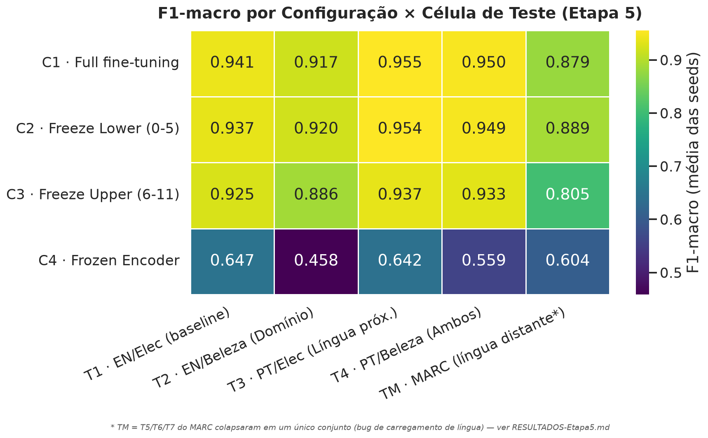
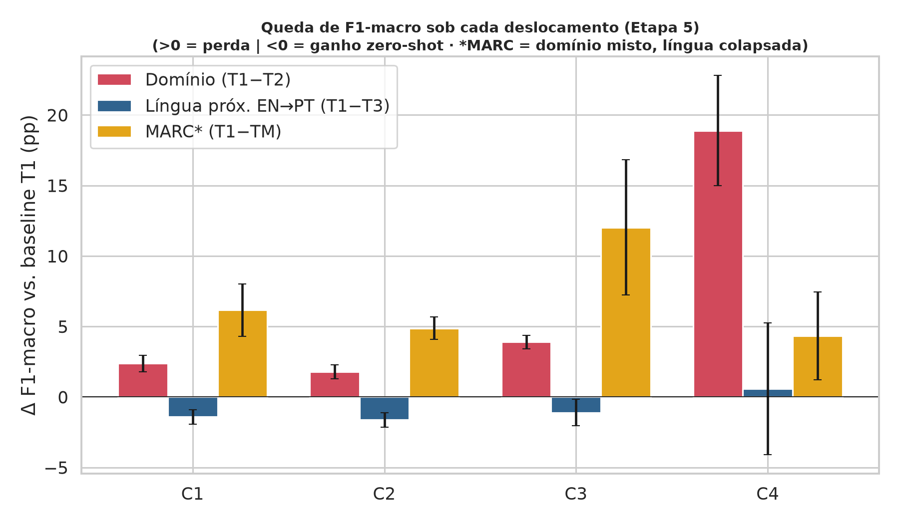

# Etapa 5 — Congelamento de Camadas em Transformers Multilíngues

### Replicação estatística e teste de língua distante

**Análise Arquitetural do Congelamento de Camadas na Mitigação de *Domain Shift* e *Language Shift* em XLM-RoBERTa**

UFG / INF — Redes Neurais Profundas
Sebastião · Pedro · Geovanna · Ricktheus

> Conteúdo pronto para gerar os slides no Gamma. Cada bloco separado por `---` é um slide. Figuras em `resultados/`.

---

## O problema em uma frase

Treinamos um classificador de sentimento em **inglês / Eletrônicos** e perguntamos:

**congelar camadas do XLM-RoBERTa ajuda o modelo a se sair bem quando muda o domínio (Beleza) ou o idioma (Português, e agora Japonês/Mandarim)?**

- 4 estratégias de congelamento: **C1** Full · **C2** Freeze Lower (0–5) · **C3** Freeze Upper (6–11) · **C4** Frozen Encoder
- Hierarquia da *BERTology*: camadas baixas = léxico/sintaxe (idioma); camadas altas = semântica (tarefa)

---

## O que a Etapa 5 acrescenta

| | Etapa 4 | **Etapa 5** |
|---|---|---|
| Seeds | 3 (`42,123,2024`) | **6–8 independentes** (3 pessoas) |
| Células de teste | T1–T4 (EN/PT) | + **T5–T7 = JA/ZH/EN (MARC)** |
| Pergunta nova | — | **Língua distante causa *shift*?** (Passo A) |

**Três objetivos:** (1) consolidar os CSVs dos três integrantes · (2) testar se as conclusões resistem a mais seeds · (3) medir o *Language Shift* em língua distante.

---

## Desenho experimental

Treino **fixo** em S1 = EN/Eletrônicos. Avaliação em 5 cenários:

| Célula | Idioma / Domínio | Mede |
|---|---|---|
| **T1** | EN / Eletrônicos | baseline |
| **T2** | EN / Beleza | **Domain Shift** |
| **T3** | PT / Eletrônicos | **Language Shift próximo** |
| **T4** | PT / Beleza | ambos |
| **TM** | MARC (JA/ZH/EN) | **Language Shift distante** |

Métrica: **F1-macro**. Testes: **Welch t** (primário) · **Mann-Whitney U** · **Cohen's *d***. Limiar **p < 0.10**.

---

## Consolidação dos três integrantes

- **Sebastião** → C1–C4, seeds `2718, 4242, 9001`
- **Pedro** → C1–C4, seeds `1234, 5678, 91011`
- **Geovanna** → **só C1** (run parcial), seeds `13, 888`

→ **`results_etapa5.csv`**: 182 medições combinadas.

**N por config:** C1 = **8 seeds** · C2/C3/C4 = **6 seeds**.
*(N desigual: Welch t e MWU toleram; mais seeds na baseline = melhor.)*

---

## Resultado 1 — Mapa geral de desempenho



- **C1 ≈ C2** em tudo (diferenças ≤ 0.4 pp)
- **C3** é sempre pior
- **C4 colapsa** (0.46–0.65) — destaque escuro na base

---

## Resultado 2 — Quanto cada deslocamento custa



- 🔵 **Língua próxima EN→PT: barras negativas** = o modelo vai *melhor* em PT (ganho zero-shot) — **não há Language Shift**
- 🔴 **Domínio EN→Beleza: real**, cresce de C2 → C3 → C4
- 🟡 **MARC**: degrau grande, mas confundido (ver slide do bug)

---

## Resultado 3 — Testes estatísticos vs. C1

Com 6–8 seeds, o Mann-Whitney agora desce a **p ≈ 0.001** (não satura mais).

| Cenário | C2 vs C1 | C3 vs C1 | C4 vs C1 |
|---|---|---|---|
| **Domínio (T2)** | +0.21 pp · n.s. | **−3.10 pp · p<0.001** | −45.9 pp · p<0.001 |
| **Língua (T3)** | −0.16 pp · n.s. | **−1.87 pp · p=0.013** | −31.4 pp · p<0.001 |

**Nenhuma config congelada supera a C1.** C3 e C4 são significativamente **piores** em todas as células.

---

## Veredito das hipóteses (replicação independente)

- ❌ **H1** (C2 mitiga língua) → **REFUTADA**: não há shift EN→PT a mitigar (Δ = −1.40 pp; C2 vs C1: p = 0.32)
- ❌ **H2** (C3 mitiga domínio) → **REFUTADA e invertida**: C3 **piora** o domínio (**Δ = −3.10 pp, p < 0.001**) — antes marginal (p=0.074), agora inequívoco

✅ **Configs viáveis C1/C2/C3 replicam dentro de < 1 pp** entre Etapa 4 e Etapa 5 → conclusões robustas a seeds.

---

## A correção mais honesta da Etapa 5

A Etapa 4 anunciou um "achado emergente": **C2 protegeria contra Domain Shift** (+1.19 pp, p = 0.086).

**Com mais seeds independentes, isso NÃO se sustenta:**

> C2 vs C1 em Domínio: **Δ = +0.21 pp, p = 0.42** — sem efeito.

**Conclusão revisada:** C2 ≡ C1 em desempenho. O valor da C2 é **eficiência** (treina ~50% menos parâmetros sem perda), **não** regularização. *Replicar muda conclusões — e é assim que tem de ser.*

---

## C4 não é um piso — é uma loteria de seed

- F1 da C4 varia de **0.36 a 0.81** entre seeds
- Desvio entre seeds ≈ **0.098** → **16× maior** que C1/C2/C3 (≈ 0.006)
- Etapa 4 (3 seeds sortudas) viu ~0.82; com seeds novas, média ~0.65

**Lição:** *probing* linear do XLM-R nesta tarefa é **não-reprodutível**. Congelar o encoder inteiro não é só fraco — é instável.

---

## ⚠️ O Passo A não mediu o que pretendia

**T5 (JA), T6 (ZH) e T7 (EN) têm F1 byte-a-byte idêntico nas 26 execuções.**

`T5 = T6 = T7 = 0.8675234985…` — impossível para 3 línguas diferentes.

**Causa:** o carregador do espelho `mteb/amazon_reviews_multi` ignorou o filtro de língua (`name=lang`) e avaliou **o mesmo conjunto 3 vezes**.

→ Tratamos como **uma** célula `TM`. A decomposição **EN→JA vs EN→ZH ficou indisponível**.
→ **Reproduzido pelos 3 integrantes** = bug no notebook, não no ambiente.

---

## Passo A — em aberto, com correção pronta

O degrau em `TM` (~6 pp) **não** é interpretável como língua: confunde domínio misto + língua + ruído de rótulo.

**Correção (1 célula do notebook):** carregar a língua por config **posicional** e **validar**:
```python
ds = load_dataset(repo, lang, split="test")
assert not df_ja_raw.equals(df_zh_raw)   # sanidade
```
**Re-execução barata:** os modelos C1–C4 já estão treinados — basta refazer a **avaliação**. Nenhum treino novo.

---

## Conclusões

1. ✅ Conclusões da Etapa 4 **robustas a seeds** (replicação por 3 pessoas)
2. ❌ **H1 e H2 refutadas** — H2 agora com evidência forte (p < 0.001)
3. 🔁 "C2 protege domínio" **não replica** → C2 ≡ C1; valor da C2 = **eficiência**
4. ⚠️ **C4 inviável e instável** (loteria de seed)
5. 🔓 **Língua distante segue em aberto** — bug isolado, correção pronta, re-run barato

---

## Próximos passos

- **Corrigir e re-rodar o Passo A** (JA/ZH separados) — responde a pergunta central
- Trocar o filtro EN por palavra-chave por **classificador de domínio** (remove o confound de qualidade EN vs PT)
- Avaliar **mais línguas distantes** (árabe, hindi) para mapear a curva de degradação
- *(Opcional)* gradiente fino de congelamento **C2a→C2b→C2c** para localizar o efeito camada a camada

---

## Obrigado

**Repositório:** `ricktheus/trabalho-de-redes-neurais-profundas`

Detalhamento completo, tabelas e p-valores: [`docs/RESULTADOS-Etapa5.md`](RESULTADOS-Etapa5.md)
Reprodução (sem GPU): `python src/analise_etapa5.py`
