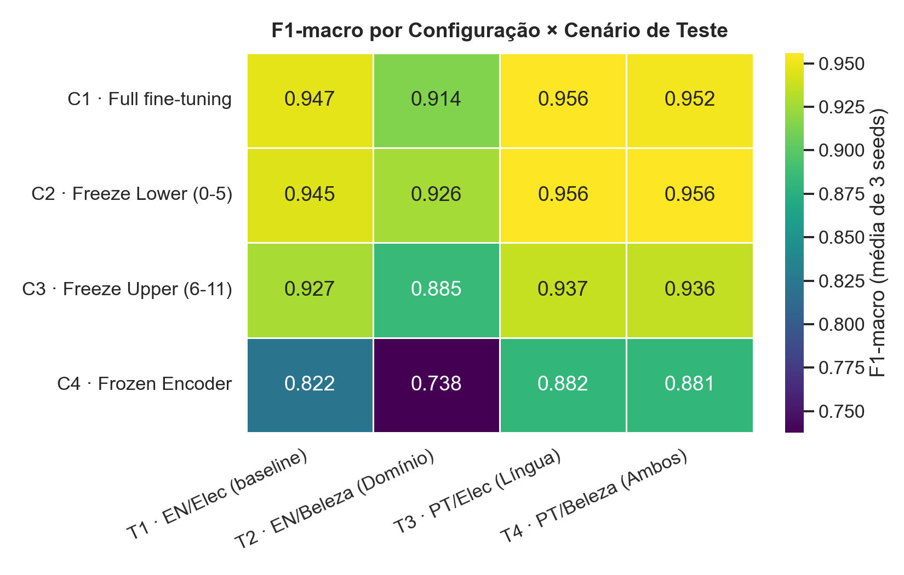
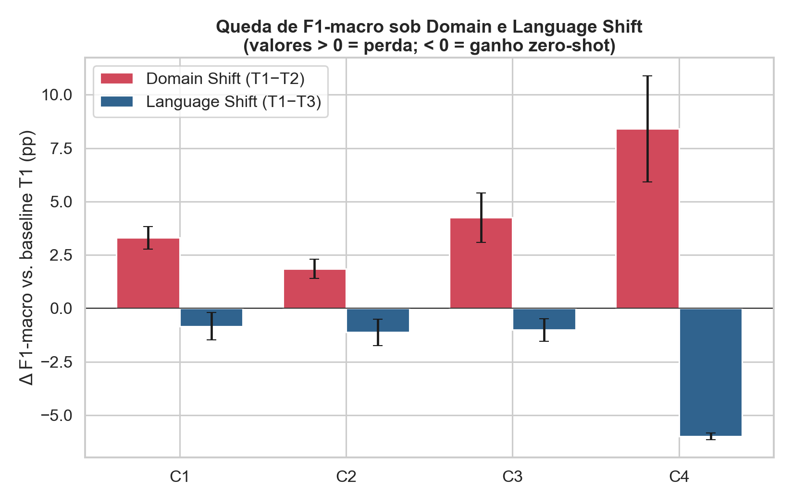

# Resultados — Etapa 4: Análise Estatística e Visualização

Relatório dos resultados da **Etapa 4** do projeto *"Análise Arquitetural do Congelamento de Camadas na Mitigação de Domain Shift e Language Shift em Transformers Multilíngues"*. Executa o plano [`PLAN-Etapa4.md`](PLAN-Etapa4.md) sobre o `results.csv` (48 medições) produzido na Etapa 3.

> **Reprodução:** `python src/analise_etapa4.py` (gera tabelas `.csv` e gráficos `.png` em `resultados/`) ou execute o notebook [`notebooks/Trabalho_RNP_Colab_Etapa4.ipynb`](../notebooks/Trabalho_RNP_Colab_Etapa4.ipynb). Não requer GPU.

---

## 1. Material de entrada

`results.csv` — **48 linhas** = 4 configurações de congelamento (C1–C4) × 3 seeds `{42, 123, 2024}` × 4 cenários de teste (T1–T4). Colunas: `config, seed, teste, f1_macro, accuracy, f1_negativo, f1_positivo`.

**Design 2×2** (o modelo é sempre treinado em **S1 = EN/Eletrônicos**):

| Teste | Conjunto | Idioma / Domínio | Tipo de shift |
|-------|----------|------------------|---------------|
| **T1** | S1_val | EN / Eletrônicos | nenhum (baseline *in-domain, in-language*) |
| **T2** | S2 | EN / Beleza | **Domain Shift** |
| **T3** | S3 | PT / Eletrônicos | **Language Shift** |
| **T4** | S4 | PT / Beleza | Domain + Language (combinado) |

**Configurações de congelamento:**

| Config | Estratégia | Camadas treináveis |
|--------|-----------|--------------------|
| **C1** | Full fine-tuning | todas (encoder + head) |
| **C2** | *Freeze Lower* | congela camadas 0–5 (léxico/sintaxe); treina 6–11 + head |
| **C3** | *Freeze Upper* | congela camadas 6–11 (semântica); treina 0–5 + head |
| **C4** | *Frozen Encoder* | congela todo o encoder; treina só a head |

---

## 2. Fase 4.1 — Tabela consolidada (F1-macro, média ± desvio de 3 seeds)

| Config | T1 · EN/Elec (baseline) | T2 · EN/Beleza (Domínio) | T3 · PT/Elec (Língua) | T4 · PT/Beleza (Ambos) |
|--------|:----------------------:|:------------------------:|:---------------------:|:----------------------:|
| **C1** · Full          | 0.9474 ± 0.0033 | 0.9143 ± 0.0067 | 0.9557 ± 0.0042 | 0.9525 ± 0.0044 |
| **C2** · Freeze Lower  | 0.9448 ± 0.0059 | **0.9262 ± 0.0015** | 0.9560 ± 0.0017 | **0.9560 ± 0.0010** |
| **C3** · Freeze Upper  | 0.9271 ± 0.0075 | 0.8846 ± 0.0165 | 0.9372 ± 0.0023 | 0.9359 ± 0.0060 |
| **C4** · Frozen Encoder| 0.8217 ± 0.0023 | 0.7376 ± 0.0267 | 0.8815 ± 0.0008 | 0.8810 ± 0.0034 |

> Negrito = melhor F1-macro da coluna. Note que **C2 vence em T2, T3 e T4** — só perde para C1 na própria baseline (T1), e por uma margem desprezível (0.0026).

Leituras imediatas:
- **C4 colapsa** em todos os cenários — congelar o encoder inteiro (apenas *probing* linear) é insuficiente para a tarefa.
- **C3 é consistentemente pior que C1 e C2** — congelar o topo semântico prejudica, não ajuda.
- **C1 e C2 são quase empatados**, com C2 levando vantagem fora da baseline.

---

## 3. Fase 4.2a — Δ-shift (queda de F1-macro vs. baseline T1, em pontos percentuais)

Convenção: `Δ = F1(T1) − F1(Tx)`. Valor **> 0 = perda** sob shift; **< 0 = ganho** zero-shot.

| Config | F1 baseline (T1) | Δ Domínio (T1−T2) | Δ Língua (T1−T3) | Δ Ambos (T1−T4) |
|--------|:---------------:|:-----------------:|:----------------:|:---------------:|
| **C1** | 0.947 | +3.30 pp | **−0.83 pp** | −0.51 pp |
| **C2** | 0.945 | **+1.86 pp** | −1.12 pp | −1.12 pp |
| **C3** | 0.927 | +4.25 pp | −1.01 pp | −0.88 pp |
| **C4** | 0.822 | +8.40 pp | −5.98 pp | −5.94 pp |

Achados estruturais:
- **O Language Shift não existe** (barras azuis negativas): todas as configs são **iguais ou melhores** em PT do que em EN, apesar de nunca terem treinado em PT. É um **ganho zero-shot cross-lingual**, não uma perda — efeito esperado do pré-treinamento multilíngue do XLM-RoBERTa.
- **O Domain Shift é real** (barras vermelhas positivas): há perda mensurável ao migrar de Eletrônicos para Beleza.
- **C2 sofre a menor queda de domínio** (+1.86 pp), menos da metade de C1 (+3.30 pp) e de C3 (+4.25 pp).

---

## 4. Fase 4.2b — Testes estatísticos vs. baseline C1

Comparações entre 3 seeds por grupo. **Welch *t*** (variâncias desiguais) como teste primário, **Mann-Whitney U** como confirmação não-paramétrica e **Cohen's *d*** como tamanho de efeito. Limiar de significância **p < 0.10** (definido na Metodologia, adequado a n=3).

| Cenário | Comparação | Descrição | Δ (pp) | p (Welch) | p (MWU) | Cohen's *d* | Magnitude | Sig. p<0.10 |
|:-------:|:----------:|-----------|:------:|:---------:|:-------:|:-----------:|:---------:|:-----------:|
| T2 | C2 vs C1 | Domínio — Freeze Lower vs Full | **+1.19** | 0.0855 | 0.10 | +2.45 | grande | ✅ **SIM** |
| T2 | C3 vs C1 | Domínio — Freeze Upper vs Full *(aposta H2)* | −2.97 | 0.0736 | 0.10 | −2.36 | grande | ✅ SIM (pior) |
| T2 | C4 vs C1 | Domínio — Frozen Encoder vs Full | −17.67 | 0.0052 | 0.10 | −9.08 | grande | ✅ SIM (pior) |
| T3 | C2 vs C1 | Língua — Freeze Lower vs Full *(aposta H1)* | +0.03 | 0.9299 | 1.00 | +0.08 | desprezível | ❌ não |
| T3 | C3 vs C1 | Língua — Freeze Upper vs Full | −1.86 | 0.0062 | 0.10 | −5.49 | grande | ✅ SIM (pior) |
| T3 | C4 vs C1 | Língua — Frozen Encoder vs Full | −7.42 | 0.0007 | 0.10 | −24.47 | grande | ✅ SIM (pior) |

> Nota: o Mann-Whitney U com n=3 vs n=3 só pode atingir p mínimo de 0.10 (não consegue descer mais por limitação combinatória), por isso o Welch *t* é o teste de referência aqui.

---

## 5. Veredito formal das hipóteses

Critério de confirmação (Metodologia): mitigação real exige **Δ ≥ +3 pp E p < 0.10**.

### ❌ H1 — *Freeze Lower (C2) mitiga o Language Shift* → **REFUTADA**

- **Pré-condição falha:** não há Language Shift a mitigar. A baseline C1 tem `T1 − T3 = −0.83 pp`, ou seja, **ganha** desempenho em PT zero-shot.
- Mesmo assim, C2 vs C1 em T3: **Δ = +0.03 pp, p = 0.9299** (efeito desprezível, não significativo).
- **Não se pode mitigar uma queda que não existe.** H1 cai por ausência do fenômeno-alvo.

### ❌ H2 — *Freeze Upper (C3) mitiga o Domain Shift* → **REFUTADA (e invertida)**

- A pré-condição é válida (há Domain Shift: `T1 − T2 = +3.30 pp` na baseline C1).
- Mas C3 vs C1 em T2: **Δ = −2.97 pp, p = 0.0736** — congelar o topo **piorou** o desempenho de forma estatisticamente significativa. O efeito é grande **na direção oposta** à prevista.

### ⭐ Achado emergente — *Freeze Lower (C2) é quem mitiga o Domain Shift* → **CONFIRMADO**

- C2 vs C1 em T2: **Δ = +1.19 pp, p = 0.0855** (significativo a p<0.10; Cohen's *d* = +2.45, efeito grande).
- A estratégia que protege contra o viés de domínio é **congelar a base sintático-lexical**, não o topo semântico — exatamente o inverso da intuição de H2.
- **Interpretação:** as representações multilíngues iniciais do XLM-RoBERTa, preservadas pelo congelamento das camadas baixas, atuam como um **regularizador** que impede o modelo de se viciar nos jargões do domínio de Eletrônicos, melhorando a generalização para Beleza.

---

## 6. Conclusões da Etapa 4 (conscientes das limitações)

> **Princípio adotado:** cada conclusão é declarada **amarrada ao seu escopo** e à limitação que a restringe. Evitamos generalizar além do que o desenho experimental sustenta. As limitações completas estão em [`Metodologia_Rascunho.md` §11](Metodologia_Rascunho.md); as condições de refutação, em §2.1.

1. **Ambas as hipóteses originais foram refutadas** — H1 por ausência do fenômeno-alvo no par testado; H2 por inversão do efeito (C3 piorou).

2. **Sobre o *Language Shift* (H1) — conclusão de escopo restrito, não lei geral.** *No par EN→PT*, não detectamos queda de língua: a baseline já performa igual ou melhor em PT (Δ T1−T3 = −0,83 pp) e C2 não altera isso (Δ = +0,03 pp, p = 0,93). **Mas esta leitura tem duas ressalvas que impedem a afirmação "o XLM-R é imune a *Language Shift*":**
   - **Confound de qualidade de dados.** O conjunto PT é *ground-truth* (categoria B2W, ~100%), enquanto a baseline EN é ruidosa (keyword, 90–94%). O "ganho zero-shot" em PT está **confundido** com o fato de o conjunto PT ser mais limpo de rotular — pode ser artefato, não transferência.
   - **Um único par de línguas próximas.** EN e PT são indo-europeias, escrita latina, alta cobertura no pré-treino. Línguas distantes (árabe, mandarim, hindi) provavelmente mostrariam degradação real.
   - **Conclusão honesta:** *"no par EN↔PT, e dada a assimetria de qualidade dos conjuntos, não há *Language Shift* a mitigar."*

3. **Sobre o *Domain Shift* (H2 e achado emergente) — robusto dentro do escopo, magnitude subestimada.** Como T1 e T2 são ambos EN, esta conclusão **não** sofre o confound de língua. O *Domain Shift* (Eletrônicos→Beleza) é real; congelar o topo (C3) o **agrava** (Δ = −2,97 pp, p = 0,074); e quem o **mitiga** é **C2 (Freeze Lower)** (Δ = +1,19 pp, p = 0,086, Cohen's *d* = +2,45). Isso sustenta a narrativa de **regularização por representações multilíngues de baixo nível**. *Ressalvas:* (a) escopo do par de domínios Eletrônicos→Beleza; (b) como o filtro EN é ruidoso, o *Domain Shift* real é **maior** que o medido — logo o efeito protetor de C2 está provavelmente **subestimado**, o que reforça a conclusão.

4. **C4 (Frozen Encoder) é um piso inviável** — a tarefa exige adaptação do encoder, não só uma head linear. *Ressalva:* o LR fixo (2e-5) pode subtreinar o C4; um LR maior poderia elevar esse piso.

5. **Robustez estatística.** n=3 seeds limita o poder (MWU satura em p=0.10); os Cohen's *d* grandes reforçam as conclusões apesar do n baixo, mas não substituem mais seeds.

### 6.1 O que refutaria nossas conclusões (e o próximo experimento)

A pergunta "**o que refutaria nossa teoria?**" tem resposta direta: **testar em outra língua**. Se a ausência de *Language Shift* observada em EN→PT **não** se repetir numa língua tipologicamente distante, fica provado que o resultado é um artefato da proximidade EN/PT, e não robustez do modelo. Por isso o **próximo passo prioritário** é adicionar uma 5ª célula de teste numa língua distante (e, em paralelo, trocar o filtro EN por keyword por um classificador de domínio para eliminar o confound de qualidade). Detalhes em [`Metodologia_Rascunho.md` §2.1 e §12](Metodologia_Rascunho.md).

---

## 7. Artefatos gerados

| Arquivo | Conteúdo |
|---------|----------|
| `resultados/tabela_f1_media_desvio.csv` | Tabela pivot F1-macro (média ± desvio) — Fase 4.1 |
| `resultados/tabela_media_f1.csv` / `tabela_desvio_f1.csv` | Médias e desvios separados (numéricos) |
| `resultados/tabela_deltas.csv` | Δ-shift por config — Fase 4.2a |
| `resultados/tabela_testes_estatisticos.csv` | p-valores + Cohen's *d* — Fase 4.2b |
| `resultados/heatmap_f1_macro.png` | Heatmap config × teste — Fase 4.3 |
| `resultados/barplot_deltas.png` | Barplot Δ Domínio vs Δ Língua — Fase 4.3 |
| `src/analise_etapa4.py` | Script reprodutível de toda a análise |
| `notebooks/Trabalho_RNP_Colab_Etapa4.ipynb` | Notebook equivalente (Colab, sem GPU) |

> **Curvas de Loss (Fase 4.3, opcional/debug):** dependem dos JSONs `resultados/runs/run_*.json` gerados na Etapa 3 e persistidos no Google Drive (não versionados no repositório). O script as gera automaticamente se a pasta `resultados/runs/` estiver presente localmente; caso contrário, pula essa figura.
